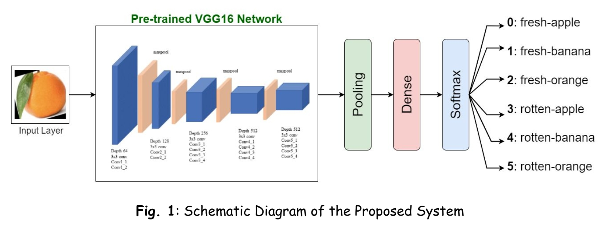

Fruit Image Classification using Transfer Learning
===================================================

<!---
Implementation for the paper (Interspeech 2021). The paper has been accepted, its full-text will be shared after publication.<br>
**[Towards the Explainability of Multimodal Speech Emotion Recognition][1]**<br>
[Puneet Kumar](https://puneet-kr.github.io/), Vishesh Kaushik, and [Balasubramanian Raman](http://faculty.iitr.ac.in/~balarfma/)  
-->

<!---->


<!---
If you use this code in your published research, please consider citing:
```text
@inproceedings{}
```
--->

Steps to run the Code
---------------------
1. Install Anaconda or Miniconda distribution and create a conda environment with **Python 3.6+**.
2. Install the requirements using the following command:
```sh
pip install -r Requirements.txt
```
3. Download the [data][2] and keep in the root folder
4. Run `Fruit_Img_Classification_TL.ipynb` in Jupyter Notebook

[1]: https://www.interspeech2021.org/
[2]: http://www.t4sa.it/
